# GitHub Insight Agent - 流程图集合

**最后更新:** 2026-04-24

---

## 1. 系统启动流程

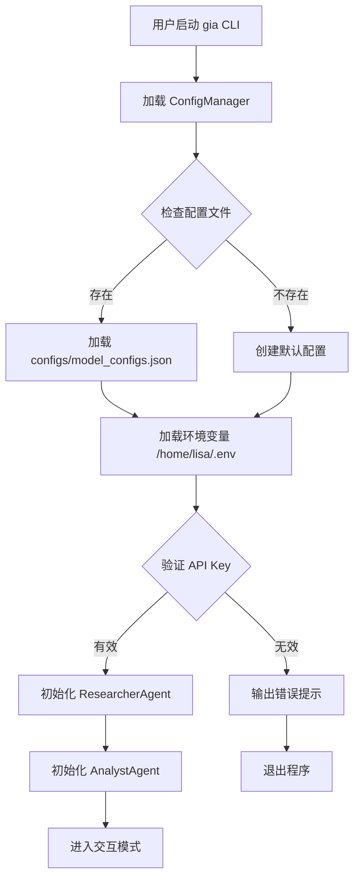

---

## 2. 用户请求处理流程

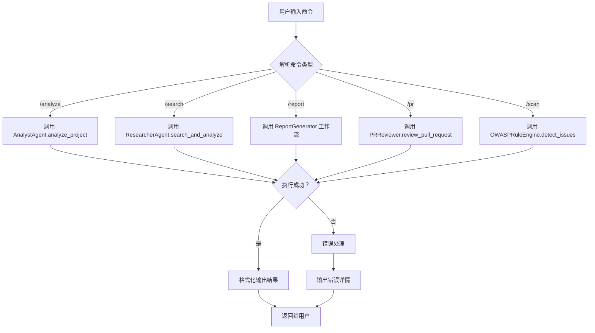

---

## 3. ResearcherAgent 搜索流程

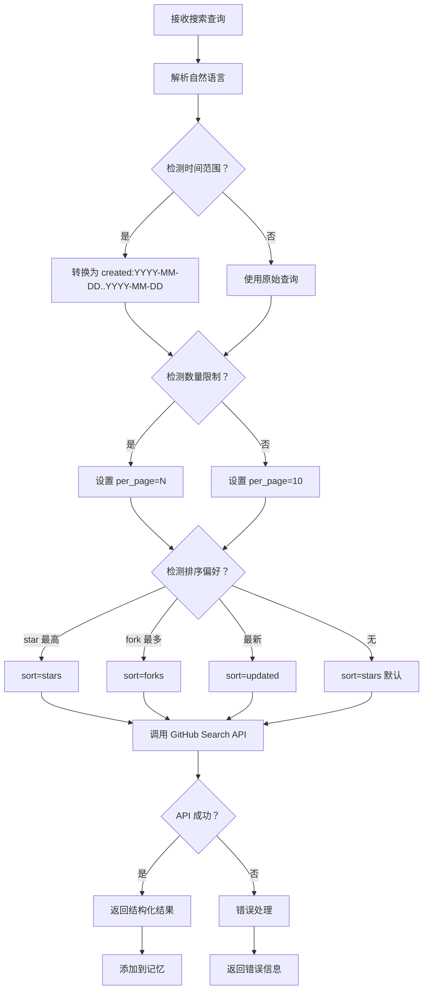

---

## 4. AnalystAgent 分析流程

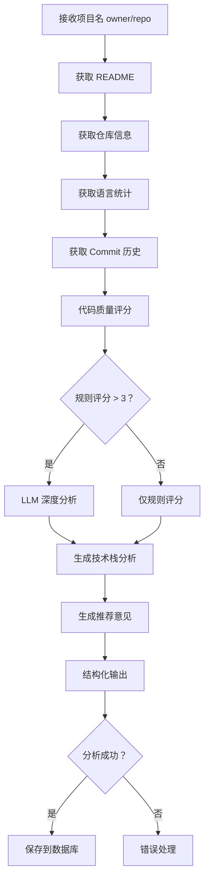

---

## 5. ReportGenerator 工作流

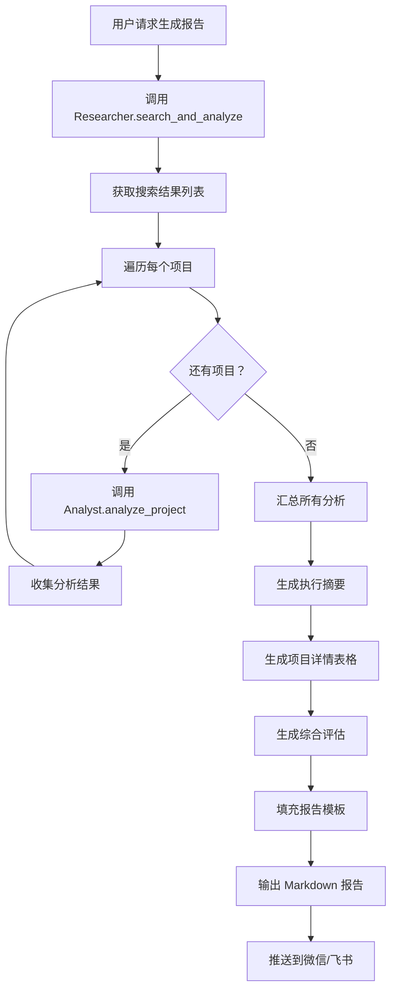

---

## 6. PR 审查流程

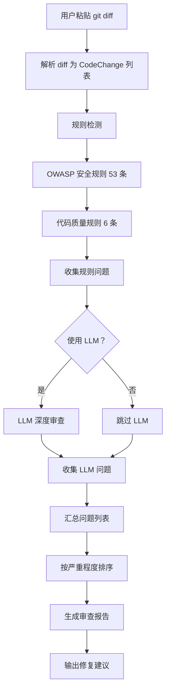

---

## 7. OWASP 安全检测流程

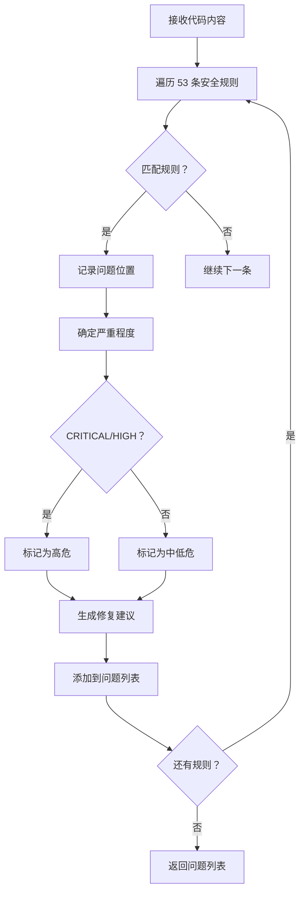

---

## 8. 配置加载流程

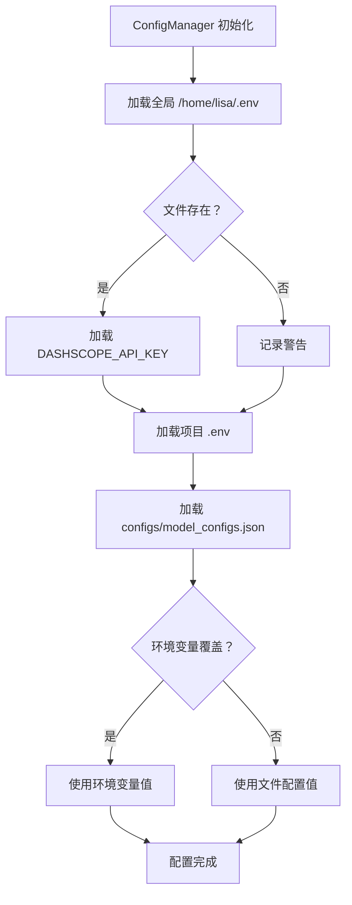

---

## 9. 持久化内存流程

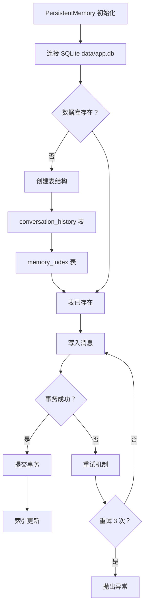

---

## 10. 定时任务执行流程 (Hermes)

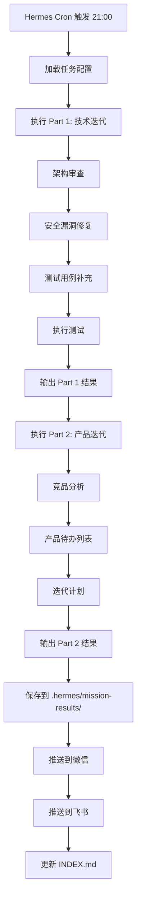

---

## 11. 错误处理流程

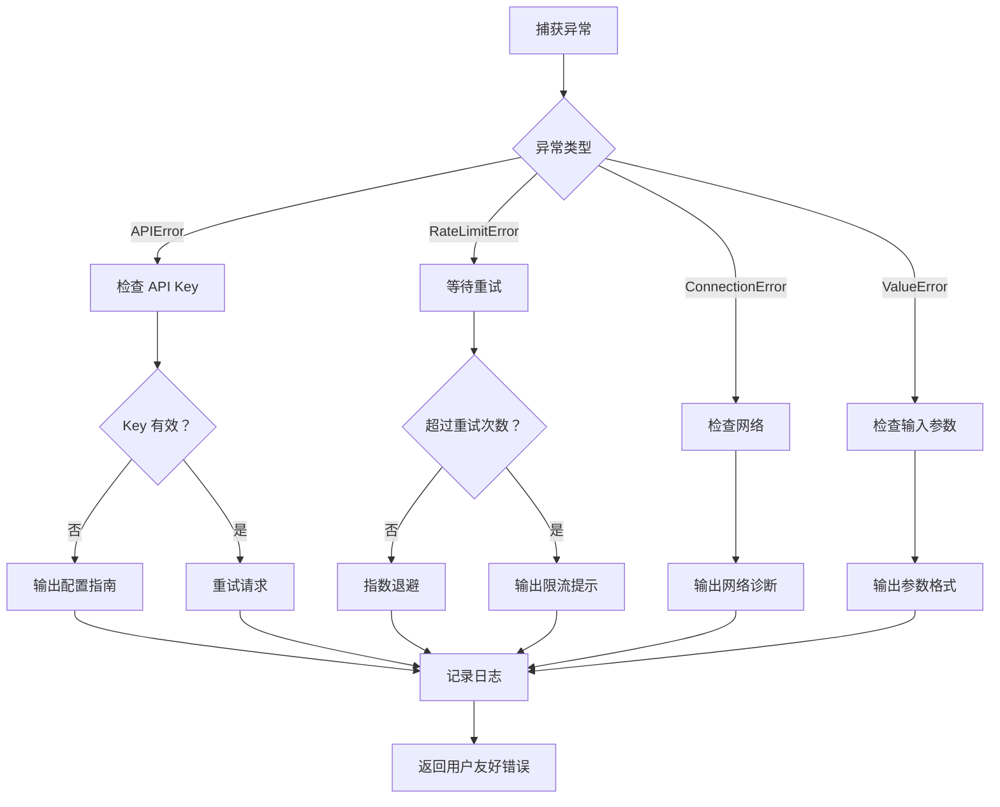

---

## 12. CI/CD 流程

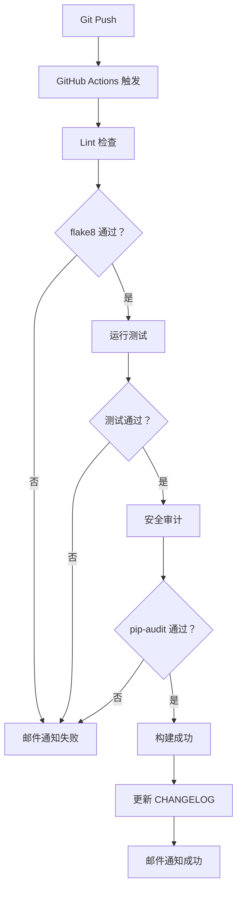

---

*图表使用 Mermaid 语法，可在支持 Mermaid 的 Markdown 查看器中渲染*
